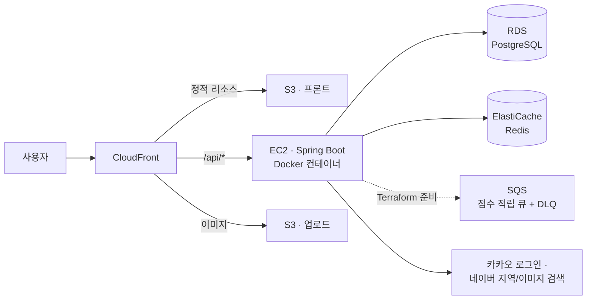

# 낙낙 (Naknak) — 지인 기반 맛집 추천 플랫폼

> **"모르는 사람 리뷰 1만 개보다, 아는 사람 리뷰 1개."**
>
> 낙낙은 광고성 리뷰에 지친 사용자를 위한 **초대제·신뢰 네트워크 기반** 맛집 리뷰 서비스입니다.
> 초대코드로만 가입할 수 있고, 피드는 팔로우 그래프를 따라 계산한 **촌수(1촌/2촌/3촌)** 로 필터링됩니다 —
> 내 피드에 보이는 리뷰는 전부 "내가 아는 사람, 혹은 그 사람이 아는 사람"이 남긴 것입니다.

Spring Boot 백엔드 저장소입니다. 프론트엔드(React + TypeScript)는 별도 저장소로 관리합니다.

## 핵심 기능

| 기능 | 설명 |
|---|---|
| 초대제 가입 | 초대코드로만 가입, 가입 즉시 초대자와 상호 팔로우. 코드 소진 시 자동 재발급 |
| 촌수 피드 | 팔로우 그래프를 재귀 CTE로 탐색해 1~3촌 리뷰만 필터링, Redis 캐싱 |
| 맛집 등록/리뷰 | 네이버 지역검색 연동 등록(중복 자동 병합), 사진 리뷰, S3 + CloudFront 서빙 |
| 게이미피케이션 | 활동 점수/포인트 적립(원장 기록), 3종 랭킹(전체·내 네트워크·동네), 포인트 복권 |
| 인증 | 카카오 OAuth + JWT(Access/Refresh), Redis 기반 토큰 관리·블랙리스트 |

## 기술 스택

- **Backend**: Java 17, Spring Boot 3.4, Spring Security, Spring Data JPA, QueryDSL
- **Database**: PostgreSQL (Flyway 마이그레이션 V1~V5), Redis (Redisson)
- **Infra**: AWS (EC2·RDS·ElastiCache·S3·CloudFront·SQS), Terraform (IaC), Docker
- **CI/CD**: GitHub Actions (OIDC — 액세스 키 없는 AWS 인증), ECR
- **Test**: JUnit 5, Mockito, Testcontainers — 테스트 124개

## 아키텍처



모든 인프라는 [Terraform 코드](infra/)로 관리하며, 시크릿은 AWS Secrets Manager에서 런타임 주입합니다.

## 기술적 의사결정

각 항목은 구현 전에 작성한 설계 문서와 함께 읽을 수 있습니다.

### 1. 촌수 계산 — 재귀 CTE 한 번으로 그래프 탐색 ([docs/feed.md](docs/feed.md))

100만 유저를 가정하면 팔로우 간선이 수천만 개가 될 수 있어, 그래프를 메모리에 올리는 BFS는 불가능합니다.
레벨별 배치 쿼리(왕복 3번)를 거쳐 최종적으로 **`WITH RECURSIVE` 쿼리 한 번**으로 1~3촌을 계산하도록
개선했습니다. 맞팔로우 사이클은 깊이 제한으로 종료되고, 다중 경로는 `MIN(degree)`로 최단 촌수를 취하며,
슈퍼노드(팔로워가 매우 많은 계정)로 인한 결과 폭발은 `LIMIT`으로 방어합니다.

계산 결과는 Redis에 TTL 10분으로 캐싱하고, 팔로우/언팔로우 시 본인 캐시만 즉시 무효화합니다 —
제3자 캐시까지 실시간 무효화하려면 역방향 그래프 전체를 훑어야 해서, 최대 10분의 지연을 의도적으로
감수한 트레이드오프입니다.

### 2. 랭킹 — Redis ZSET으로 O(log n) 조회 ([docs/score.md](docs/score.md))

전체 랭킹은 모든 유저가 같은 결과를 보는 조회라 캐시 효율이 가장 높습니다. 매 요청마다
`ORDER BY total_score DESC` + `COUNT(*)`를 실행하던 것을 **Redis ZSET 상시 유지** 방식으로 바꿔,
점수 적립 시점에 `ZINCRBY`로 증분 반영하고 조회는 `ZREVRANGE`/`ZREVRANK`로 처리합니다.
콜드스타트(캐시 유실)는 센티널 키 + DB 1회 backfill로 복구합니다.

반면 **내 네트워크 랭킹·동네 랭킹은 캐싱하지 않았습니다** — 유저마다 결과가 달라 히트율이 낮고 대상
집합이 작아, 캐시 레이어 추가는 과설계라고 판단했습니다. "무엇을 캐싱할까"만큼 "무엇을 캐싱하지
않을까"도 의사결정입니다.

### 3. 점수 적립 비동기화 — SQS producer/consumer ([docs/score.md](docs/score.md))

리뷰 작성 요청 하나가 리뷰 저장 + 점수/포인트 UPDATE + 원장 INSERT 2건 + Redis 갱신을 동기로 처리하면
트래픽 증가 시 응답 지연으로 직결됩니다. `ScoreEarnPublisher` 인터페이스로 추상화해 **운영(큐 설정 시)은
SQS 발행 → 롱폴링 컨슈머 처리, 로컬/테스트는 동기 직접호출로 자동 폴백**하도록 했습니다.
재시도는 SQS visibility timeout에 맡기고(앱 코드에 재시도 로직 없음), 반복 실패는 DLQ로 격리합니다.

구현 과정에서 두 구현체를 각각 `@Component` + `@ConditionalOnMissingBean`으로 등록하면 컴포넌트 스캔
순서에 따라 빈이 하나도 등록되지 않을 수 있다는 문제를 겪었고, 하나의 `@Configuration` 안의 `@Bean`
메서드 2개로 옮겨 조건 평가 순서를 보장하는 방식으로 해결했습니다.

### 4. 점수 vs 포인트 분리 + 원장 패턴 ([docs/score.md](docs/score.md))

랭킹용 **점수**(누적만 됨)와 지갑용 **포인트**(복권 응모로 차감됨)를 분리해 "복권을 사면 랭킹이
떨어지는" 불합리를 구조적으로 차단했습니다. 모든 적립/차감은 append-only 원장
(`user_score_history`)에 기록되며, 이 테이블은 가장 빨리 커지는 테이블이라 **월별 range 파티션**으로
전환했습니다 (Postgres 파티션 제약으로 PK가 복합키가 되는 영향까지 검토 — V5 마이그레이션).

### 5. 복권 추첨 — 스케줄러 없는 지연 추첨 ([docs/raffle.md](docs/raffle.md))

추첨 시각이 지난 뒤 **첫 조회가 발생할 때** 추첨하는 lazy 방식으로, 크론/스케줄러 인프라 없이 배치성
로직을 구현했습니다. 당첨자는 응모 횟수 비례 가중치 랜덤으로 서버에서만 결정하고, 클라이언트는 이미
결정된 결과를 연출만 합니다.

## 설계 문서

| 문서 | 내용 |
|---|---|
| [erd.md](docs/erd.md) | 전체 ERD |
| [auth.md](docs/auth.md) · [user.md](docs/user.md) | 카카오 OAuth, JWT, 초대코드 |
| [follow.md](docs/follow.md) · [feed.md](docs/feed.md) | 팔로우, 촌수 계산(재귀 CTE + Redis) |
| [restaurant.md](docs/restaurant.md) · [review.md](docs/review.md) · [upload.md](docs/upload.md) | 맛집 등록, 리뷰, S3 업로드 |
| [score.md](docs/score.md) · [raffle.md](docs/raffle.md) | 점수/포인트/랭킹, 복권 |
| [scaling.md](docs/scaling.md) | 100만 트래픽 대비 단계별 로드맵 |

## 로컬 실행

```bash
# PostgreSQL 16 + Redis 7 실행
docker compose up -d

# 애플리케이션 실행 (local 프로필)
./gradlew bootRun --args='--spring.profiles.active=local'

# 테스트 (SchemaValidationTest는 Docker 필요 — Testcontainers)
./gradlew test
```
