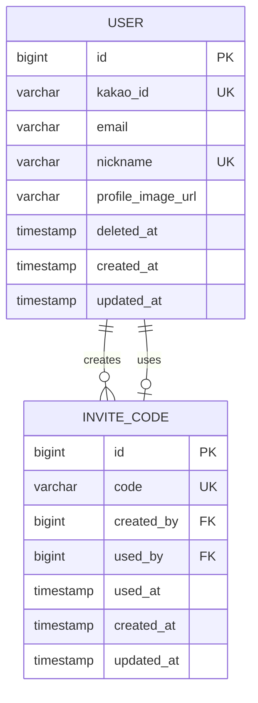
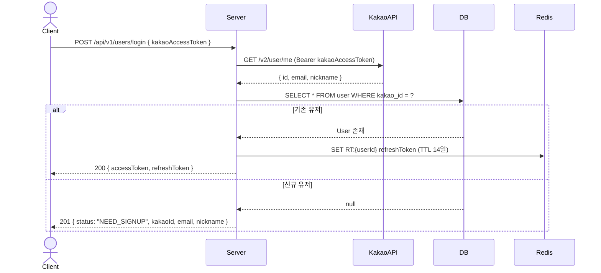
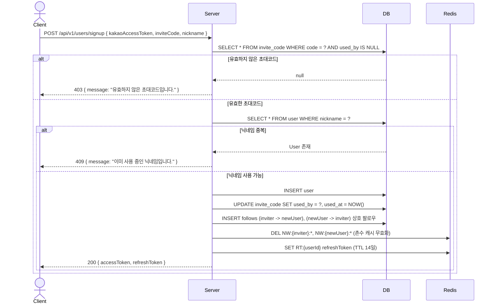
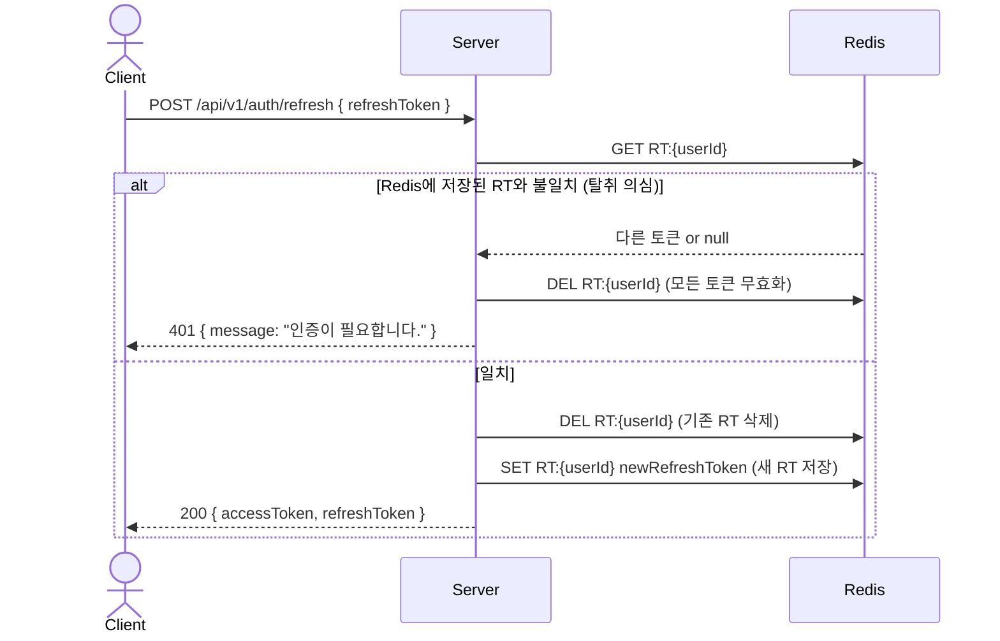
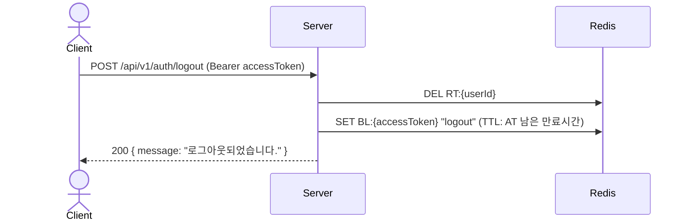

# 인증/인가 설계 문서

## 요구사항

### 기능 요구사항
- 카카오 OAuth2 로그인 전용 (자체 회원가입 없음)
- 초대코드가 있어야만 회원가입 가능
- 최초 씨앗 유저는 관리자가 직접 생성
- Access Token(15분) + Refresh Token(14일) 이중 토큰 구조
- 로그아웃 시 토큰 즉시 무효화

### 비즈니스 규칙
- 초대코드는 1회만 사용 가능
- **내 초대코드가 소진되면(이미 누군가 써서 미사용 코드가 없으면) 다음 조회 시점에 새 코드를
  자동 발급한다.** 초대코드는 가입 시 딱 1개만 만들어지고 그 뒤로는 재발급 로직이 없었던 게
  버그였다 — 지인을 한 명 초대하고 나면 "내 초대코드"가 영영 안 뜨는 상태였다. 이제
  `GET /api/v1/users/me`(마이페이지/초대 다이얼로그가 호출)가 미사용 코드를 찾지 못하면 그 자리에서
  새 코드를 만들어 저장하고 내려준다 — 즉, 지인을 몇 명이든 계속 초대할 수 있다.
- Refresh Token은 사용할 때마다 새 토큰으로 교체 (RTR 전략)
- 탈퇴한 유저는 소프트 딜리트 (deleted_at)
- **초대코드로 가입하면 초대한 사람과 자동으로 맞팔로우(상호 follow)된다.** 초대코드를 썼다는 것
  자체가 서로 아는 사이라는 뜻이므로, 가입 직후 촌수 피드가 텅 비지 않도록 가입 트랜잭션 안에서
  `follows` row를 양방향으로 생성한다 ([follow.md](follow.md) 참고). 팔로우 실패(이미 팔로우 중인
  경우 등)는 발생하지 않는다 — 신규 유저이므로 항상 최초 팔로우.

---

## ERD

---

## 시퀀스 다이어그램

### 1. 로그인

### 2. 회원가입

### 3. 토큰 재발급 (RTR)

### 4. 로그아웃

---

## API 명세

| Method | URL | Auth | 설명 |
|---|---|---|---|
| POST | /api/v1/users/login | X | 카카오 로그인 |
| POST | /api/v1/users/signup | X | 회원가입 |
| POST | /api/v1/auth/refresh | X | 토큰 재발급 |
| POST | /api/v1/auth/logout | O | 로그아웃 |
| POST | /internal/admin/seed-user | Admin Key | 씨앗 유저 생성 |