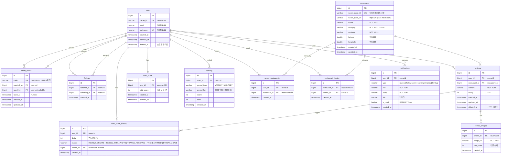

## ERD

```mermaid
erDiagram
    users {
        bigint id PK
        varchar kakao_id UK "NOT NULL"
        varchar email "NOT NULL"
        varchar nickname UK "NOT NULL"
        timestamp created_at
        timestamp updated_at
        timestamp deleted_at "소프트 딜리트"
    }

    invite_codes {
        bigint id PK
        varchar code UK "NOT NULL, UUID 8자리"
        bigint created_by FK "users.id"
        bigint used_by FK "users.id, nullable"
        timestamp used_at "nullable"
        timestamp created_at
        timestamp updated_at
    }

    follows {
        bigint id PK
        bigint follower_id FK "users.id"
        bigint following_id FK "users.id"
        timestamp created_at
    }

    restaurants {
        bigint id PK
        varchar naver_place_id UK "네이버 플레이스 ID"
        varchar naver_place_url "https://m.place.naver.com/..."
        varchar name "NOT NULL"
        varchar category "NOT NULL, Enum"
        varchar address "NOT NULL"
        double latitude "WGS84"
        double longitude "WGS84"
        timestamp created_at
        timestamp updated_at
    }

    reviews {
        bigint id PK
        bigint user_id FK "users.id"
        bigint restaurant_id FK "restaurants.id"
        varchar content "NOT NULL"
        int rating "1~5"
        timestamp created_at
        timestamp updated_at
        timestamp deleted_at "소프트 딜리트"
    }

    review_images {
        bigint id PK
        bigint review_id FK "reviews.id"
        varchar image_url "NOT NULL"
        int sort_order "정렬 순서"
        timestamp created_at
    }

    user_score {
        bigint id PK
        bigint user_id FK "users.id, UK"
        int total_score "현재 누적 XP"
        timestamp created_at
        timestamp updated_at
    }

    user_score_history {
        bigint id PK
        bigint user_id FK "users.id"
        int delta "변동량 (+/-)"
        varchar reason "REVIEW_CREATE | REVIEW_WITH_PHOTO | THANKS_RECEIVED | FRIEND_INVITED | STREAK_3DAYS"
        bigint review_id FK "reviews.id, nullable"
        timestamp created_at
    }

    ranking {
        bigint id PK
        bigint user_id FK "users.id"
        varchar period_type "WEEKLY | MONTHLY"
        varchar period_key "2026-W23 | 2026-06"
        int score
        int rank
        timestamp created_at
    }

    saved_restaurants {
        bigint id PK
        bigint user_id FK "users.id"
        bigint restaurant_id FK "restaurants.id"
        timestamp created_at
    }

    restaurant_thanks {
        bigint id PK
        bigint restaurant_id FK "restaurants.id"
        bigint sender_id FK "users.id"
        timestamp created_at
    }

    notifications {
        bigint id PK
        bigint user_id FK "users.id"
        varchar type "review | follow | point | ranking | thanks | levelup"
        varchar title "NOT NULL"
        varchar body "NOT NULL"
        varchar link "딥링크"
        boolean is_read "DEFAULT false"
        timestamp created_at
    }

    users ||--o{ invite_codes : "creates"
    users ||--o{ invite_codes : "uses"
    users ||--o{ follows : "follower"
    users ||--o{ follows : "following"
    users ||--o{ reviews : "writes"
    users ||--|| user_score : "has"
    users ||--o{ user_score_history : "has"
    users ||--o{ ranking : "ranked"
    users ||--o{ saved_restaurants : "saves"
    users ||--o{ restaurant_thanks : "sends"
    users ||--o{ notifications : "receives"
    restaurants ||--o{ reviews : "has"
    restaurants ||--o{ saved_restaurants : "saved_by"
    restaurants ||--o{ restaurant_thanks : "receives"
    reviews ||--o{ review_images : "has"
    reviews ||--o{ user_score_history : "triggers"
```

