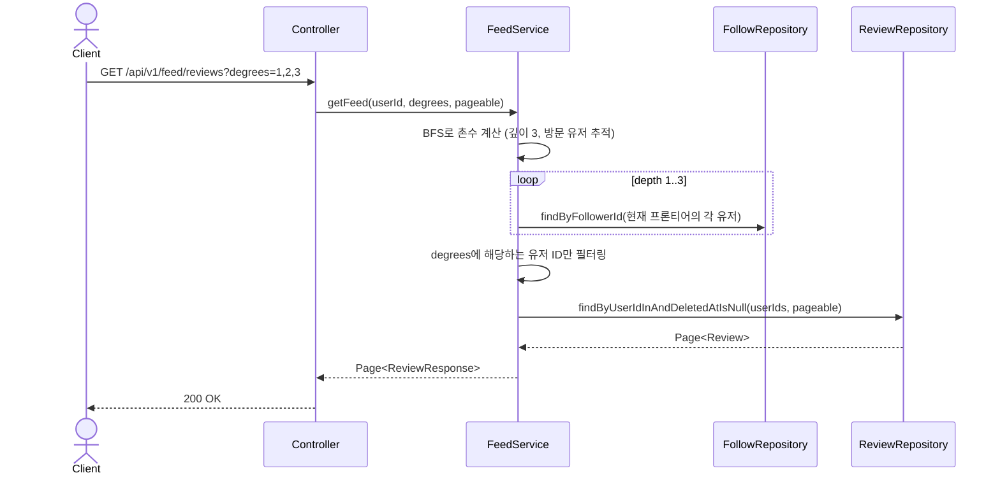

# Feed(촌수 기반 홈 피드) 도메인 (설계)

## 배경

홈 화면(`DiscoveryFeed.tsx`)에 1촌/2촌/3촌+ 필터 UI는 이미 있었지만, 실제로는 촌수 계산 로직이
없어서 필터 선택과 무관하게 항상 "내 리뷰"만 보여주고 있었다 (`GET /api/v1/users/me/reviews`).
팔로우 기능이 생겼으니, 팔로우 그래프를 실제로 타고 들어가 촌수를 계산하고 그에 맞는 리뷰를
내려주는 API를 만든다.

## 촌수 정의

- **1촌**: 내가 팔로우하는 사람
- **2촌**: 내 1촌이 팔로우하는 사람 (나 자신, 1촌 제외)
- **3촌+**: 내 2촌이 팔로우하는 사람 (나 자신, 1촌, 2촌 제외) — 4촌 이상은 구분하지 않고 전부
  3촌+ 버킷에 포함한다 (BFS를 깊이 3에서 멈추고, 그 깊이에서 발견된 사람은 전부 3촌+로 취급).
  초기 사용자 규모에서 4촌 이상을 별도로 나눌 실익이 없다고 판단.
- 팔로우 그래프는 사이클이 생길 수 있으므로(A↔B 맞팔로우), 방문한 유저는 다시 방문하지 않는다
  (BFS 특성상 처음 도달한 경로가 항상 최단 경로 = 최소 촌수).

## API 목록

| Method | Path | 설명 | 인증 |
|---|---|---|---|
| GET | /api/v1/feed/reviews?degrees=1,2,3&page=&size= | 선택한 촌수에 해당하는 유저들의 리뷰 피드 (페이징) | 필요 |

`degrees`는 콤마로 구분된 정수 목록(1~3). 예: `degrees=1,3`이면 1촌과 3촌+ 리뷰만 보여주고
2촌은 제외. 빈 값/미전달 시 빈 목록으로 취급(빈 페이지 반환) — 프론트에서 필터를 전부 끈
경우와 동일하게 처리.

## 비즈니스 규칙

- 촌수 계산은 매 요청마다 즉시 계산한다 (캐싱하지 않음). 초기 사용자 규모(수백~수천 명, 팔로우
  간선 수도 적음)에서는 BFS 비용이 무시할 만한 수준이라 별도 비동기 집계 테이블을 두지 않는다.
  사용자 규모가 커지면 그때 캐싱 전략을 재검토한다.
- 촌수 계산에 필요한 데이터는 기존 `follows` 테이블만으로 충분하다 — 스키마 변경 없음.
- 리뷰 조회는 기존 `ReviewRepository`에 `findByUserIdInAndDeletedAtIsNull(Collection<Long>, Pageable)`
  하나만 추가한다.
- 응답 DTO는 기존 `ReviewResponse`를 그대로 재사용한다.

## 시퀀스 다이어그램

### 촌수 필터 기반 피드 조회

## 프론트 영향

- `DiscoveryFeed.tsx`의 `GET /api/v1/users/me/reviews` 호출을
  `GET /api/v1/feed/reviews?degrees=...`로 교체.
- 선택된 `networkFilters`(`1st`/`2nd`/`3rd`)를 `degrees` 쿼리 파라미터로 매핑해서 전달.
- 지도 마커도 이 API가 내려주는 리뷰의 `restaurantId` 기준으로 그대로 구성 (기존 로직 재사용).
- (추후 과제, 이번 범위 아님) 지도 마커를 촌수별 색상으로 구분하려면 `ReviewResponse`에
  `authorDegree` 같은 필드가 추가로 필요 — 지금은 범위에서 제외.
