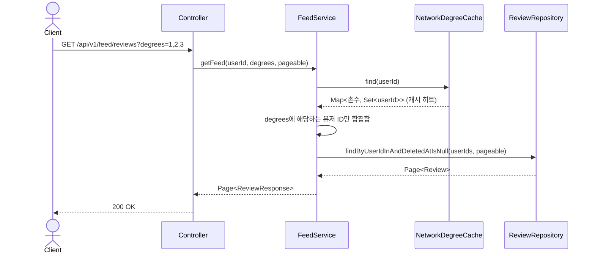
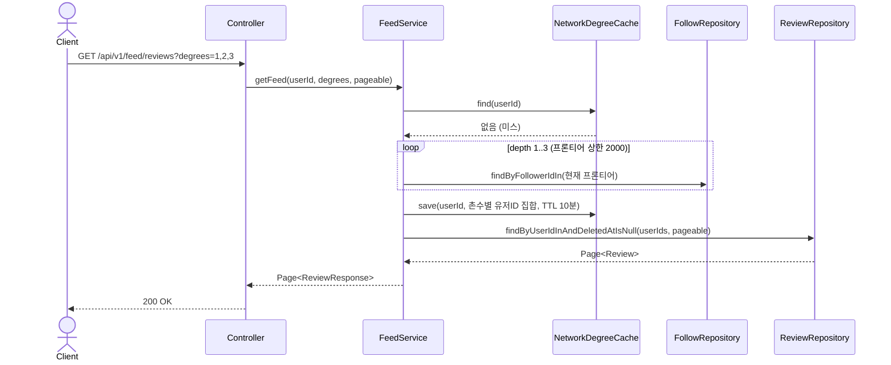
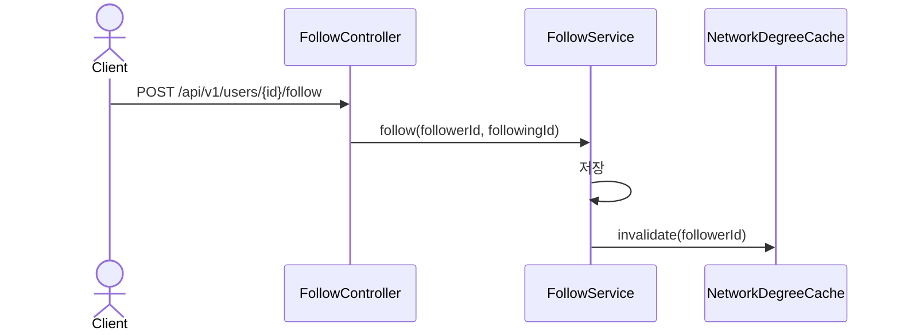

# Feed(촌수 기반 홈 피드) 도메인 (설계)

## 배경

홈 화면(`DiscoveryFeed.tsx`)에 1촌/2촌/3촌+ 필터 UI는 이미 있었지만, 실제로는 촌수 계산 로직이
없어서 필터 선택과 무관하게 항상 "내 리뷰"만 보여주고 있었다 (`GET /api/v1/users/me/reviews`).
팔로우 기능이 생겼으니, 팔로우 그래프를 실제로 타고 들어가 촌수를 계산하고 그에 맞는 리뷰를
내려주는 API를 만든다.

**사용자 규모 가정: 100만 명.** 이 전제가 설계를 크게 바꾼다 (아래 "스케일 고려사항" 참고).

## 촌수 정의

- **1촌**: 내가 팔로우하는 사람
- **2촌**: 내 1촌이 팔로우하는 사람 (나 자신, 1촌 제외)
- **3촌+**: 내 2촌이 팔로우하는 사람 (나 자신, 1촌, 2촌 제외) — 4촌 이상은 구분하지 않고 전부
  3촌+ 버킷에 포함한다 (BFS를 깊이 3에서 멈추고, 그 깊이에서 발견된 사람은 전부 3촌+로 취급).
- 팔로우 그래프는 사이클이 생길 수 있으므로(A↔B 맞팔로우), 방문한 유저는 다시 방문하지 않는다
  (BFS 특성상 처음 도달한 경로가 항상 최단 경로 = 최소 촌수).

## 스케일 고려사항 (100만 유저 가정)

1차 구현(전체 `follows` 테이블을 한 번에 로딩해서 메모리 BFS)은 100만 유저 규모에서
간선 수가 수천만 개일 수 있어 요청 하나가 메모리를 통째로 잡아먹는다. 두 가지를 함께 적용한다.

### 1. 배치 쿼리 BFS (매 요청 계산 시)
레벨별로 `WHERE follower_id IN (:프론티어)` 형태의 배치 쿼리만 사용한다 (유저 하나씩 쿼리하는
N+1도, 테이블 전체를 읽는 것도 하지 않는다). 쿼리 횟수는 깊이(3)에 비례할 뿐, 유저 수/간선
수와 무관하다.

다만 소셜 그래프는 "6단계 분리"처럼 몇 다리만 건너도 프론티어가 폭발적으로 커질 수 있다
(팔로워가 아주 많은 계정 하나만 껴도 2~3촌이 수만~수십만 명이 될 수 있음). 이를 막기 위해
**레벨당 프론티어 크기에 상한(`MAX_FRONTIER_SIZE = 2000`)**을 둔다. 상한을 넘으면 그 레벨에서
먼저 발견된 유저까지만 사용하고 나머지는 잘라낸다 — 정확도보다 요청 하나가 시스템 전체에
영향을 주지 않는 것을 우선한다. 일반적인 사용자(팔로우 수천 명 미만)에게는 사실상 영향이 없다.

### 2. Redis 캐싱 (반복 요청 비용 제거)
그래도 매 요청마다 배치 BFS를 도는 건 낭비이므로, 계산 결과를 Redis(이미 refresh
token/blacklist에 쓰고 있는 것과 동일한 Redisson 클라이언트)에 캐싱한다.

- 키: `NW:{userId}:d1`, `NW:{userId}:d2`, `NW:{userId}:d3` — 각 촌수에 해당하는 유저 ID 집합
  (Redis Set)
- 캐시 존재 여부 마커: `NW:{userId}:computed` (센티널 키, TTL 만료 시 캐시 없음으로 간주)
- **TTL: 10분.** 만료되면 자동으로 다시 계산.
- **즉시 무효화**: 유저가 팔로우/언팔로우를 하면, 그 유저 본인의 캐시(`NW:{followerId}:*`)를
  즉시 삭제한다 (`FollowService.follow`/`unfollow`에서 호출). 내가 방금 판 팔로우가 바로
  반영되어야 하기 때문.
- **정합성 트레이드오프**: 내가 팔로우한 상대방이 아니라, "나를 거쳐서 촌수가 바뀐 제3자"의
  캐시까지는 실시간으로 무효화하지 않는다 (그러려면 역방향 그래프 전체를 다시 훑어야 해서
  배보다 배꼽이 커짐). 최대 10분(TTL) 지연을 감수한다 — 소셜 피드에서 "누가 방금 팔로우했는지"가
  즉시 100% 정확할 필요는 없다는 일반적인 트레이드오프.

## API 목록

| Method | Path | 설명 | 인증 |
|---|---|---|---|
| GET | /api/v1/feed/reviews?degrees=1,2,3&page=&size= | 선택한 촌수에 해당하는 유저들의 리뷰 피드 (페이징) | 필요 |

`degrees`는 콤마로 구분된 정수 목록(1~3). 예: `degrees=1,3`이면 1촌과 3촌+ 리뷰만 보여주고
2촌은 제외. 빈 값/미전달 시 빈 목록으로 취급(빈 페이지 반환) — 프론트에서 필터를 전부 끈
경우와 동일하게 처리.

## 비즈니스 규칙

- 촌수 계산에 필요한 데이터는 기존 `follows` 테이블만으로 충분하다 — 스키마 변경 없음.
- 캐시 조회 → 미스 시 배치 BFS 계산 → 캐시 저장 → 이번 요청은 방금 계산한 값을 바로 사용
  (캐시를 다시 읽는 왕복 없음).
- 팔로우/언팔로우 시 본인 촌수 캐시를 무효화한다 (follow 도메인이 캐시를 소유).
- 리뷰 조회는 기존 `ReviewRepository`에 `findByUserIdInAndDeletedAtIsNull(Collection<Long>, Pageable)`
  하나만 추가한다.
- 응답 DTO는 기존 `ReviewResponse`를 그대로 재사용한다.

## 시퀀스 다이어그램

### 1. 촌수 필터 기반 피드 조회 (캐시 히트)

### 2. 촌수 필터 기반 피드 조회 (캐시 미스)

### 3. 팔로우 시 캐시 무효화

## 프론트 영향

- `DiscoveryFeed.tsx`의 `GET /api/v1/users/me/reviews` 호출을
  `GET /api/v1/feed/reviews?degrees=...`로 교체.
- 선택된 `networkFilters`(`1st`/`2nd`/`3rd`)를 `degrees` 쿼리 파라미터로 매핑해서 전달.
- 지도 마커도 이 API가 내려주는 리뷰의 `restaurantId` 기준으로 그대로 구성 (기존 로직 재사용).
- (추후 과제, 이번 범위 아님) 지도 마커를 촌수별 색상으로 구분하려면 `ReviewResponse`에
  `authorDegree` 같은 필드가 추가로 필요 — 지금은 범위에서 제외.
