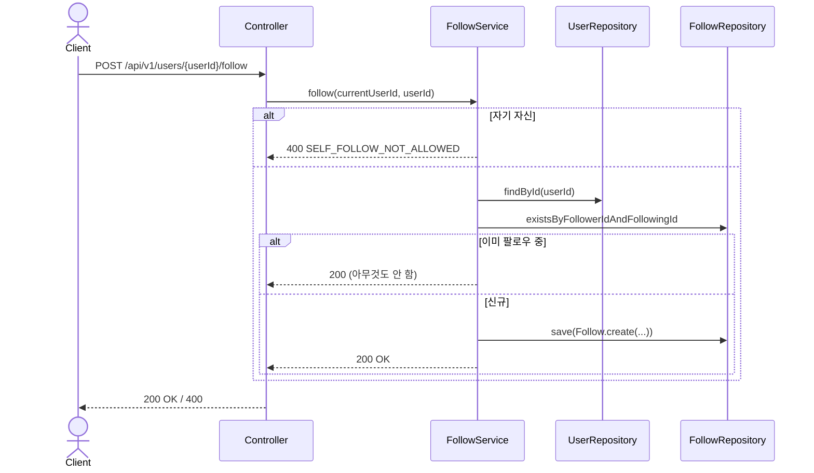
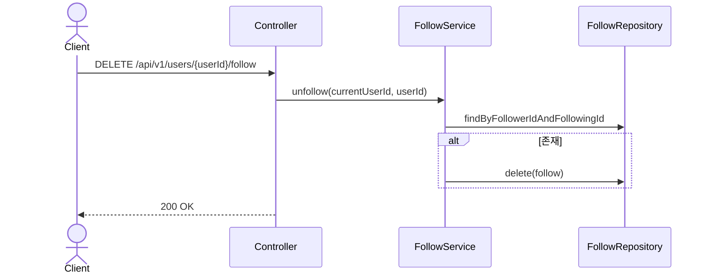

# Follow 도메인

## API 목록

| Method | Path | 설명 | 인증 |
|---|---|---|---|
| POST | /api/v1/users/{userId}/follow | 팔로우 | 필요 |
| DELETE | /api/v1/users/{userId}/follow | 언팔로우 | 필요 |
| GET | /api/v1/users/me/following | 내가 팔로우 중인 유저 ID 목록 | 필요 |

## 비즈니스 규칙

- 자기 자신은 팔로우할 수 없다 (`SELF_FOLLOW_NOT_ALLOWED`).
- 이미 팔로우 중인 상태에서 다시 팔로우를 호출하면 에러 없이 멱등하게 무시한다 (중복 저장 안 함).
- `follows` 테이블은 `created_at`만 갖고 `updated_at`/`deleted_at`은 없다 — 언팔로우는 소프트 딜리트가 아니라 row를 실제로 지운다 (`BaseTimeEntity` 대신 자체 감사 필드, `review_images`와 동일한 패턴).
- 팔로워/팔로잉 개수는 `MyProfileResponse`/`UserProfileResponse`에 포함된다 ([profile.md](profile.md) 참고).

## 시퀀스 다이어그램

### 1. 팔로우

### 2. 언팔로우

