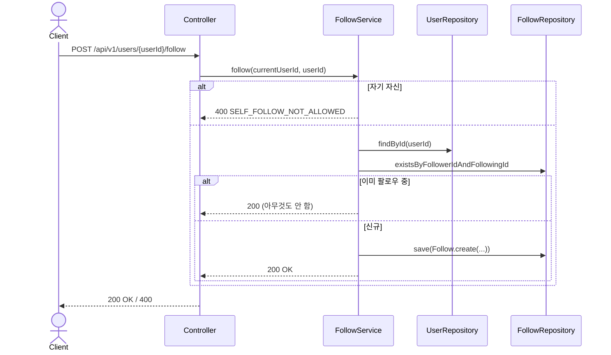
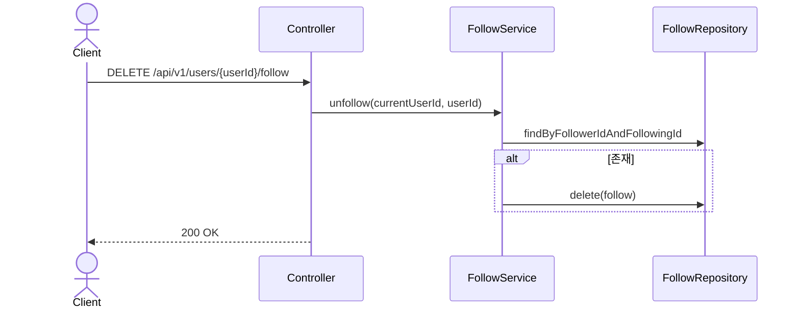

# Follow 도메인

## API 목록

| Method | Path | 설명 | 인증 |
|---|---|---|---|
| POST | /api/v1/users/{userId}/follow | 팔로우 | 필요 |
| DELETE | /api/v1/users/{userId}/follow | 언팔로우 | 필요 |
| GET | /api/v1/users/me/following | 내가 팔로우 중인 유저 ID 목록 | 필요 |
| GET | /api/v1/users/me/followers | 나를 팔로우하는 유저 목록 (id, nickname) | 필요 |
| GET | /api/v1/users/me/following-users | 내가 팔로우 중인 유저 목록 (id, nickname) | 필요 |

## 비즈니스 규칙

- 자기 자신은 팔로우할 수 없다 (`SELF_FOLLOW_NOT_ALLOWED`).
- 이미 팔로우 중인 상태에서 다시 팔로우를 호출하면 에러 없이 멱등하게 무시한다 (중복 저장 안 함).
- `follows` 테이블은 `created_at`만 갖고 `updated_at`/`deleted_at`은 없다 — 언팔로우는 소프트 딜리트가 아니라 row를 실제로 지운다 (`BaseTimeEntity` 대신 자체 감사 필드, `review_images`와 동일한 패턴).
- 팔로워/팔로잉 개수는 `MyProfileResponse`/`UserProfileResponse`에 포함된다 ([profile.md](profile.md) 참고).
- 초대코드로 회원가입하면 초대한 사람과 자동으로 상호 팔로우된다 ([auth.md](auth.md)의 회원가입
  시퀀스 참고) — `UserService.signup()`이 가입 트랜잭션 안에서 `FollowService.follow()`를 양방향으로
  호출한다.
- 팔로워/팔로잉 유저 목록(닉네임 포함)은 **본인 프로필에서만** 조회할 수 있다 — `/me/followers`,
  `/me/following-users`처럼 항상 로그인한 본인 기준으로만 제공하고, 임의의 `userId`로 남의
  팔로워/팔로잉 목록을 조회하는 API는 만들지 않는다. 프론트에서도 남의 프로필을 볼 때는 팔로워/
  팔로잉 카운트 자체를 노출하지 않는다 (프라이버시 — 본인 소셜 그래프는 본인만 확인 가능).

## 시퀀스 다이어그램

### 1. 팔로우

### 2. 언팔로우

