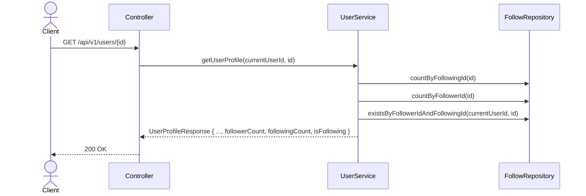

# Profile 확장 (설계)

## 배경

기존 `MyProfileResponse`/`UserProfileResponse`에는 팔로워/팔로잉 수가 없었다.
또한 "타인 프로필 보기" 화면 자체가 프론트에 없었고(내 프로필 페이지만 존재), 타인의 리뷰만
따로 조회하는 API도 없었다. 이번에 다음을 추가한다.

## 변경되는 API

| Method | Path | 변경 내용 | 인증 |
|---|---|---|---|
| GET | /api/v1/users/me | `MyProfileResponse`에 `followerCount`, `followingCount` 추가 | 필요 |
| GET | /api/v1/users/{id} | `UserProfileResponse`에 `followerCount`, `followingCount`, `isFollowing`(요청자 기준) 추가 | 필요 |
| GET | /api/v1/users/{id}/reviews | (신규) 특정 유저의 공개 리뷰 목록 (페이징) — 타인 프로필의 "후기" 탭용 | 필요 |

`isFollowing`은 로그인한 사용자가 그 프로필의 주인을 팔로우하고 있는지 여부다. 본인 프로필 조회 시(`/me`)에는 의미가 없으므로 `MyProfileResponse`에는 넣지 않는다.

## 비즈니스 규칙

- `followerCount` = `FollowRepository.countByFollowingId(userId)` (나를 팔로우하는 사람 수)
- `followingCount` = `FollowRepository.countByFollowerId(userId)` (내가 팔로우하는 사람 수)
- `GET /users/{id}/reviews`는 `getMyReviews`와 동일 로직이나 대상 `userId`가 경로 파라미터로 온다는 점만 다르다 (본인 인증 불필요, 리뷰는 공개 정보).

## 프론트 영향 (타인 프로필 화면)

- `UserProfilePage`가 `userId` 파라미터를 받으면 "타인 프로필 모드"로 동작한다.
  - 프로필 수정 / 친구 초대 버튼 숨김.
  - 탭은 "후기"(`GET /users/{id}/reviews`)와 "저장"(`GET /users/{id}/saved-restaurants`, [saved-restaurant.md](saved-restaurant.md))만 노출 — 그 외 개인 설정 관련 UI는 없음.
  - 헤더에 팔로워/팔로잉 수 + 팔로우/팔로잉 토글 버튼 표시.
- 파라미터가 없으면(자기 프로필) 기존과 동일하게 `/api/v1/users/me` 기준으로 동작.

## 시퀀스 다이어그램

### 타인 프로필 조회

