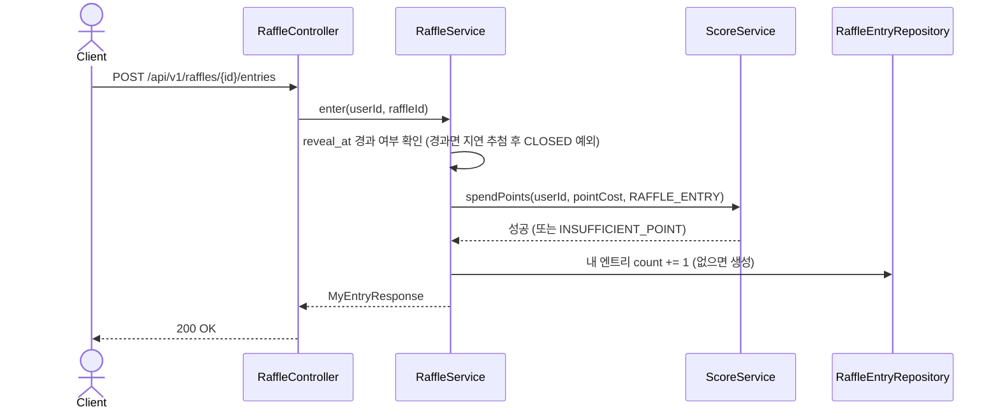
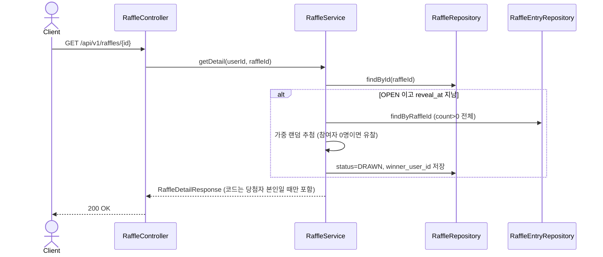

# Raffle(복권/래플) 도메인 (설계)

## 배경

수익화 2단계. [score.md](score.md)에서 쌓은 포인트를 실제로 쓸 곳을 만든다 — 관리자가 상품(교촌치킨
상품권 등, 1천/5천/1만/2만원 단위)을 걸고 이벤트를 열면, 유저는 포인트로 응모권을 사서 응모한다.
많이 응모할수록(포인트를 많이 쓸수록) 당첨 확률이 올라간다. 정해진 공개일에 추첨 결과가 공개되고,
당첨자는 그 게시물에서 상품권 코드를 받는다.

## 핵심 설계 결정

- **추첨 시점 = "지연 추첨"(lazy draw)**: 별도 스케줄러(cron)를 두지 않는다. `reveal_at`이 지난
  래플을 **누구든 최초로 조회하는 순간** 서버가 그 자리에서 추첨을 실행하고 결과를 저장한다(이후
  조회는 저장된 결과를 그대로 반환 — 재추첨하지 않음). 스케줄러 인프라 없이도 "정해진 날짜가 되면
  결과가 나온다"를 만족하면서, 결과는 항상 서버가 한 번만 결정하고 모든 클라이언트가 같은 결과를
  본다(클라이언트가 각자 랜덤을 돌리면 조작 가능하고 사람마다 다른 결과가 보이는 문제를 막음).
- **가중치 응모**: 유저가 포인트를 쓸 때마다 그 래플에 대한 내 엔트리(장수)가 늘어난다. 추첨은
  "전체 엔트리 합계 중 랜덤 한 장을 뽑는" 가중 랜덤이라, 많이 산 사람일수록 확률이 높다 — 하지만
  0장인 사람은 절대 당첨될 수 없다(엔트리가 0이면 추첨 후보에 아예 들어가지 않음).
- **상품권 코드는 관리자가 나중에 입력**: 추첨 자체는 "누가 당첨인지"만 정하고, 실제 기프티콘/
  상품권 코드 문자열은 관리자가 (현실에서 구매해서) 별도로 입력한다. 당첨자 본인만 코드를 조회할
  수 있다.
- **관리자 작업은 API로 만들지 않는다**: 래플 생성/상품권 코드 입력은 이번 단계에선 관리자
  엔드포인트를 따로 만들지 않고, 씨앗 유저 관리 때와 동일하게 **DB에 직접 SQL로** 처리한다(1인
  운영 규모에서 인증 체계 없는 관리자 API를 열어두는 리스크를 피하기 위함). 정식 어드민 화면/인증은
  이후 별도 과제.

## 데이터 모델 (V4 마이그레이션)

```sql
-- V4__add_raffle.sql
CREATE TABLE raffles (
    id                     BIGSERIAL PRIMARY KEY,
    title                  VARCHAR(100) NOT NULL,
    prize_name             VARCHAR(100) NOT NULL,
    prize_amount_krw       INT          NOT NULL,
    point_cost_per_entry   INT          NOT NULL,
    reveal_at              TIMESTAMP    NOT NULL,
    status                 VARCHAR(10)  NOT NULL DEFAULT 'OPEN',
    winner_user_id         BIGINT       REFERENCES users (id),
    gift_code              VARCHAR(200),
    created_at             TIMESTAMP    NOT NULL DEFAULT NOW()
);

CREATE TABLE raffle_entries (
    id          BIGSERIAL PRIMARY KEY,
    raffle_id   BIGINT NOT NULL REFERENCES raffles (id),
    user_id     BIGINT NOT NULL REFERENCES users (id),
    count       INT    NOT NULL DEFAULT 0,
    created_at  TIMESTAMP NOT NULL DEFAULT NOW(),
    updated_at  TIMESTAMP NOT NULL DEFAULT NOW(),
    CONSTRAINT uk_raffle_entry_raffle_user UNIQUE (raffle_id, user_id)
);

CREATE INDEX idx_raffle_entries_raffle_id ON raffle_entries (raffle_id);
```

- `raffles.status`: `OPEN`(응모 가능) → `DRAWN`(추첨 완료, `reveal_at` 경과 후 최초 조회 시 전환).
- `raffle_entries`는 유저당 1행 — 같은 래플에 여러 번 응모하면 `count`가 누적된다(엔트리 row가
  여러 개 생기지 않음). `follows`/`saved_restaurants`와 달리 `count`가 변하는 값이라
  `updated_at`도 필요해서 `BaseTimeEntity`를 그대로 쓴다.

## 적립 정책과의 연결

응모 1회 = `point_cost_per_entry`만큼 포인트 차감. 이미 만들어둔
`ScoreService.spendPoints(userId, amount, reason)`([score.md](score.md) 참고)를 그대로 쓰고,
`ScoreReason`에 `RAFFLE_ENTRY`를 추가한다(점수/포인트 적립용 델타는 0 — 차감 전용 사유라 `earn()`이
아니라 `spendPoints()`에서만 쓰인다).

## API 목록

| Method | Path | 설명 | 인증 |
|---|---|---|---|
| GET | /api/v1/raffles | 진행 중/최근 래플 목록 | 필요 |
| GET | /api/v1/raffles/{id} | 래플 상세 (reveal_at 경과 시 이 호출에서 지연 추첨 실행) | 필요 |
| POST | /api/v1/raffles/{id}/entries | 포인트로 응모 (엔트리 +1, 포인트 차감) | 필요 |

래플 생성과 상품권 코드 입력은 API가 아니라 운영자가 직접 SQL로 처리한다(위 "핵심 설계 결정"
참고) — `INSERT INTO raffles (...) VALUES (...)`, 추첨 후 `UPDATE raffles SET gift_code = ? WHERE
id = ?`.

## 비즈니스 규칙

- `OPEN` 상태의 래플만 응모 가능. `reveal_at`이 이미 지났으면 응모 API는 거부한다
  (`RAFFLE_CLOSED`) — 응모 시점에도 지연 추첨을 트리거해서 마감 처리한다.
- 존재하지 않는 래플 조회/응모는 `RAFFLE_NOT_FOUND`.
- 포인트가 부족하면 `ScoreService.spendPoints`가 이미 처리하는 `INSUFFICIENT_POINT`를 그대로
  전파한다.
- 추첨 로직: 그 래플의 모든 `raffle_entries`(count > 0)를 모아 총 장수만큼의 가중치 랜덤으로 1명을
  뽑는다. 참여자가 0명이면 당첨자 없이 `DRAWN`으로만 전환한다(유찰).
- 상품권 코드는 `winner_user_id`와 요청자 `userId`가 같을 때만 응답에 포함한다. 그 외 사용자에게는
  당첨자 닉네임까지만 보여주고 코드 필드는 항상 `null`.

## 시퀀스 다이어그램

### 1. 포인트로 응모


### 2. 래플 상세 조회 (지연 추첨)


## 프론트 영향

- 신규 `RafflePage.tsx` — 진행 중 래플 목록, 상세(내 엔트리 수, 포인트로 응모 버튼), 공개된 래플은
  **복권 공이 나오는 연출**로 당첨자를 보여준다(서버가 이미 결정한 결과를 애니메이션으로 재생하는
  것 — 클라이언트가 결과를 계산하지 않음). 당첨자 본인에게는 상품권 코드 노출.
- `PointsPage.tsx`의 "복권 응모는 준비 중이에요" 카드를 `RafflePage`로 이동하는 실제 진입점으로
  교체.
- 관리자 화면은 이번 범위 밖 — 위에서 말한 대로 SQL로 직접 운영한다.
