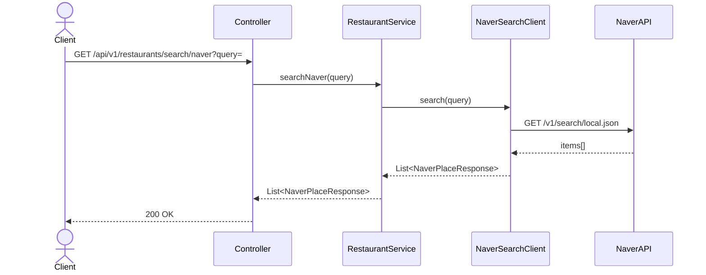
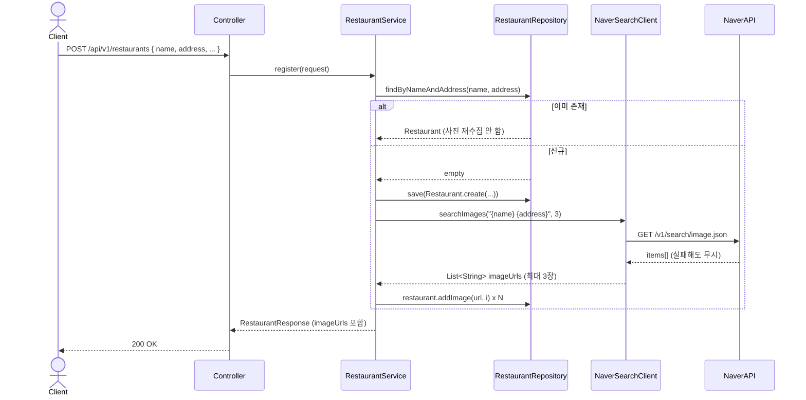

# Restaurant 도메인

## API 목록

| Method | Path | 설명 | 인증 |
|---|---|---|---|
| GET | /api/v1/restaurants/search/naver?query= | 네이버 지역검색 프록시 (등록 전 후보 검색) | 필요 |
| POST | /api/v1/restaurants | 맛집 등록 (이름+주소 중복이면 기존 것 재사용) | 필요 |
| GET | /api/v1/restaurants/search?keyword= | 등록된 맛집 검색 (페이징) | 필요 |
| GET | /api/v1/restaurants/{id} | 맛집 상세 조회 | 필요 |

## 비즈니스 규칙

- 맛집 등록은 `(name, address)` 조합으로 중복을 판단한다. 이미 같은 이름+주소가 있으면 새로 만들지 않고 기존 row를 반환한다 (같은 맛집에 여러 명이 리뷰를 남기는 시나리오를 지원하기 위함).
- `naverPlaceUrl`은 네이버 지역검색 API의 `link` 필드를 그대로 신뢰하지 않는다. 이 필드는 "네이버 플레이스 페이지"가 아니라 업체가 등록한 자체 홈페이지 URL이라 대부분 비어있거나 부정확하다. `place.naver.com`/`map.naver.com` 도메인이 아니면 대신 링크를 만들어 저장하는데, 우선순위는 다음과 같다:
  1. 검색 결과에 좌표(mapx/mapy)가 있으면 `https://map.naver.com/?lat=&lng=&title=` 형태로 그 좌표에 정확히 핀을 꽂는 링크를 만든다(비공식이지만 널리 쓰이는 형식 — 텍스트 매칭이 아니라 좌표 기반이라 동명이인/유사 상호로 엉뚱한 검색 결과가 나올 위험이 없다).
  2. 좌표가 없는 예외적인 경우에만 이름+주소로 네이버 지도 검색 URL(`https://map.naver.com/p/search/...`)을 만든다(이 경우 유사 상호가 있으면 검색 결과 목록으로 빠질 수 있음).
  (지역검색 API 무료 범위에서는 실제 플레이스 ID를 제공하지 않아 `place.naver.com`으로의 완벽한 딥링크 자체는 불가능한 구조적 한계 — 좌표 핀 방식은 이 한계 안에서 나온 최선의 대안)
- **맛집 대표 사진**: 지역검색 API(`local.json`)는 사진을 전혀 내려주지 않는다. 그래서 맛집이 실제로
  등록되는 시점(중복이 아니라 새로 생성되는 경우)에 네이버 이미지 검색 API(`image.json`, 지역검색과
  동일한 클라이언트 키 사용)를 `"{name} {address}"` 쿼리로 한 번 호출해서 상위 결과 최대 3장을
  `restaurant_images`에 저장한다. 검색 결과 후보 리스트(등록 전) 단계에서는 사진을 가져오지 않는다 —
  후보 5개마다 이미지 API를 호출하면 느리고 낭비이므로, 사용자가 실제로 하나를 선택해 등록을
  확정하는 순간에만 1회 호출한다.
  - 이미 존재하는 맛집(중복 재사용)이면 이미지 API를 다시 호출하지 않는다.
  - 이미지 검색이 실패하거나 결과가 없어도 맛집 등록 자체는 실패시키지 않는다(사진은 optional).
  - 리뷰에 첨부된 사진(`review_images`)과는 별개 테이블이다 — 리뷰 사진은 사용자가 직접 찍어 올린
    후기 사진, 맛집 대표 사진은 네이버 검색 결과에서 가져온 참고용 사진이라 성격이 다르다.

## 시퀀스 다이어그램

### 1. 네이버 지역검색 (등록 전 후보 검색)

### 2. 맛집 등록 (중복 재사용 + 대표 사진 수집)

