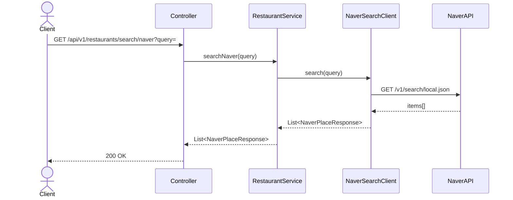
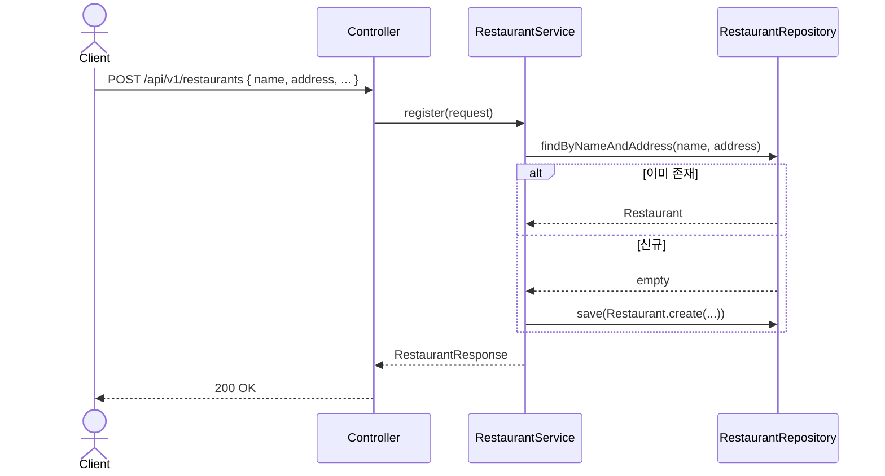

# Restaurant 도메인

## API 목록

| Method | Path | 설명 | 인증 |
|---|---|---|---|
| GET | /api/v1/restaurants/search/naver?query= | 네이버 지역검색 프록시 (등록 전 후보 검색) | 필요 |
| POST | /api/v1/restaurants | 맛집 등록 (이름+주소 중복이면 기존 것 재사용) | 필요 |
| GET | /api/v1/restaurants/search?keyword= | 등록된 맛집 검색 (페이징) | 필요 |
| GET | /api/v1/restaurants/{id} | 맛집 상세 조회 | 필요 |

## 비즈니스 규칙

- 맛집 등록은 `(name, address)` 조합으로 중복을 판단한다. 이미 같은 이름+주소가 있으면 새로 만들지 않고 기존 row를 반환한다 (같은 맛집에 여러 명이 리뷰를 남기는 시나리오를 지원하기 위함).
- `naverPlaceUrl`은 네이버 지역검색 API의 `link` 필드를 그대로 신뢰하지 않는다. 이 필드는 "네이버 플레이스 페이지"가 아니라 업체가 등록한 자체 홈페이지 URL이라 대부분 비어있거나 부정확하다. `place.naver.com`/`map.naver.com` 도메인이 아니면 이름+주소로 네이버 지도 검색 URL(`https://map.naver.com/p/search/...`)을 대신 만들어 저장한다. (지역검색 API 무료 범위에서는 실제 플레이스 ID를 제공하지 않아 완벽한 딥링크는 불가능한 구조적 한계)

## 시퀀스 다이어그램

### 1. 네이버 지역검색 (등록 전 후보 검색)

### 2. 맛집 등록 (중복 재사용)

