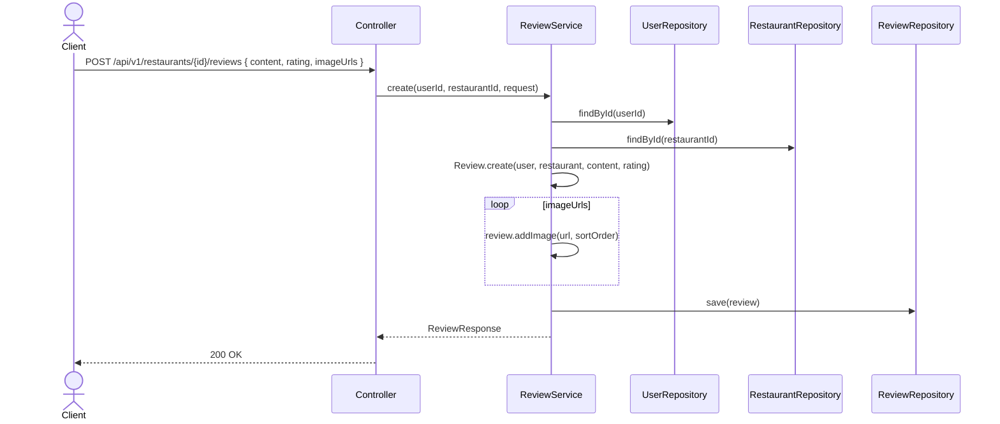
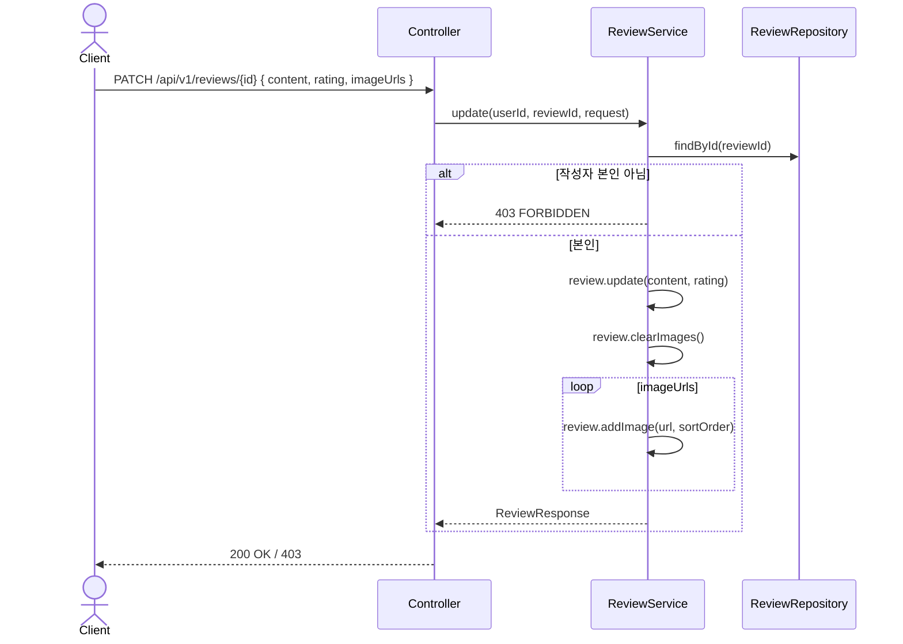
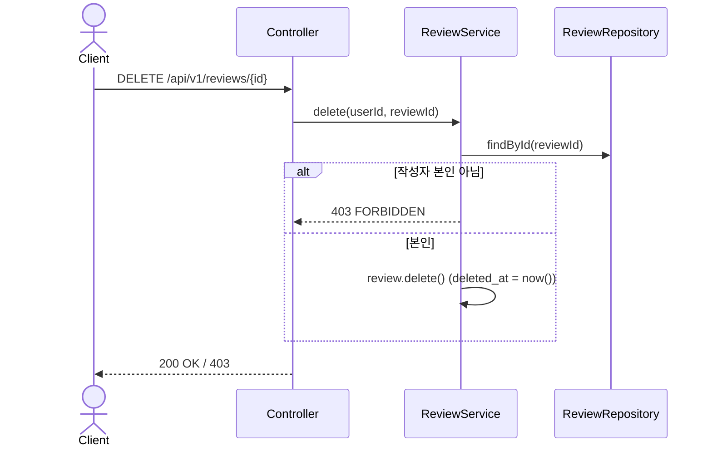

# Review 도메인

## API 목록

| Method | Path | 설명 | 인증 |
|---|---|---|---|
| POST | /api/v1/restaurants/{restaurantId}/reviews | 리뷰 작성 | 필요 |
| GET | /api/v1/restaurants/{restaurantId}/reviews | 특정 맛집의 리뷰 목록 (페이징) | 필요 |
| GET | /api/v1/users/me/reviews | 내 리뷰 목록 (페이징) | 필요 |
| PATCH | /api/v1/reviews/{reviewId} | 리뷰 수정 (본인만) | 필요 |
| DELETE | /api/v1/reviews/{reviewId} | 리뷰 삭제 (본인만, 소프트 딜리트) | 필요 |

## 비즈니스 규칙

- 리뷰는 `deleted_at` 소프트 딜리트를 쓴다. 목록 조회는 `deletedAtIsNull` 조건으로 필터링한다.
- 수정/삭제는 작성자 본인만 가능하다 (`review.getUser().getId() != userId` 면 `FORBIDDEN`).
- 리뷰 사진은 `ReviewImage`로 별도 테이블에 정렬 순서(`sortOrder`)와 함께 저장한다. 수정 시에는 기존 이미지를 전부 지우고(`clearImages`) 요청에 담긴 `imageUrls` 순서대로 다시 추가하는 방식(전체 교체)이다 — 개별 이미지 diff는 하지 않는다.
- `content`는 단일 문자열 컬럼이다. 추천메뉴/해시태그 같은 구조화된 하위 필드는 DB 스키마 변경 없이 프론트에서 정해진 텍스트 포맷으로 인코딩해 저장한다 (`client/src/lib/reviewContent.ts` 참고).

## 시퀀스 다이어그램

### 1. 리뷰 작성 (사진 포함)

### 2. 리뷰 수정 (본인 검증 + 이미지 전체 교체)

### 3. 리뷰 삭제 (소프트 딜리트)

