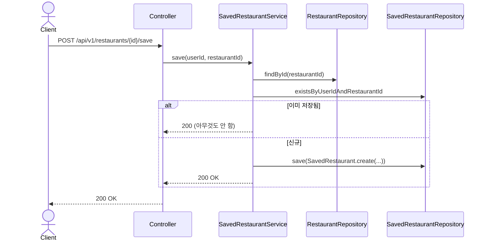
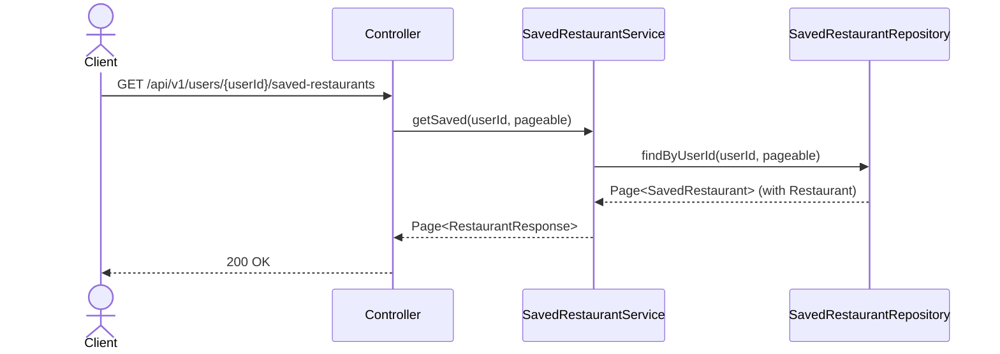

# SavedRestaurant 도메인 (설계)

## 배경

기존에는 "저장한 맛집"이 프론트 `localStorage`(기기별)로만 관리되어 서버에 데이터가 없었다.
그래서 다른 유저의 프로필에서는 그 사람이 무엇을 저장했는지 알 방법이 없었다.
`saved_restaurants` 테이블은 `V1__init_schema.sql`에 이미 정의되어 있었지만
(스키마만 미리 설계되고 구현은 없던 상태) 엔티티/API가 없어 사용되지 않고 있었다 — 이번에 구현한다.

## 스키마 (기존 V1 마이그레이션, 변경 없음)
```sql
CREATE TABLE saved_restaurants (
    id             BIGSERIAL PRIMARY KEY,
    user_id        BIGINT NOT NULL REFERENCES users (id),
    restaurant_id  BIGINT NOT NULL REFERENCES restaurants (id),
    created_at     TIMESTAMP NOT NULL DEFAULT NOW(),
    UNIQUE (user_id, restaurant_id)
);
```
`created_at`만 있음 → `follows`/`review_images`와 동일하게 `BaseTimeEntity` 대신 자체 감사 필드를 쓴다.

## API 목록

| Method | Path | 설명 | 인증 |
|---|---|---|---|
| POST | /api/v1/restaurants/{restaurantId}/save | 맛집 저장 | 필요 |
| DELETE | /api/v1/restaurants/{restaurantId}/save | 저장 취소 | 필요 |
| GET | /api/v1/users/me/saved-restaurants | 내가 저장한 맛집 목록 (페이징) | 필요 |
| GET | /api/v1/users/{userId}/saved-restaurants | 특정 유저가 저장한 맛집 목록 (페이징) — 타인 프로필의 "저장" 탭용 | 필요 |

## 비즈니스 규칙

- `(user_id, restaurant_id)` 유니크 제약 — 중복 저장 요청은 멱등 처리(이미 있으면 아무것도 안 함).
- 저장 취소는 row를 실제로 삭제한다 (소프트 딜리트 아님).
- 응답은 `RestaurantResponse`를 그대로 재사용한다 (별도 DTO 불필요).

## 프론트 영향

- `useSavedRestaurants` 훅이 `localStorage` 대신 위 API를 호출하도록 교체된다.
- 로그인 전(비로그인) 상태에서는 저장 기능 자체가 의미 없으므로(인증 필요), 비로그인 사용자에게는 저장 버튼 클릭 시 로그인 유도만 한다 — 별도 게스트 저장 캐시는 두지 않는다.

## 시퀀스 다이어그램

### 1. 맛집 저장


### 2. 특정 유저의 저장 목록 조회 (타인 프로필)

