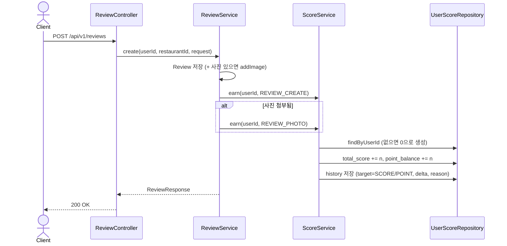
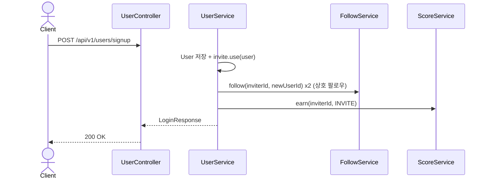
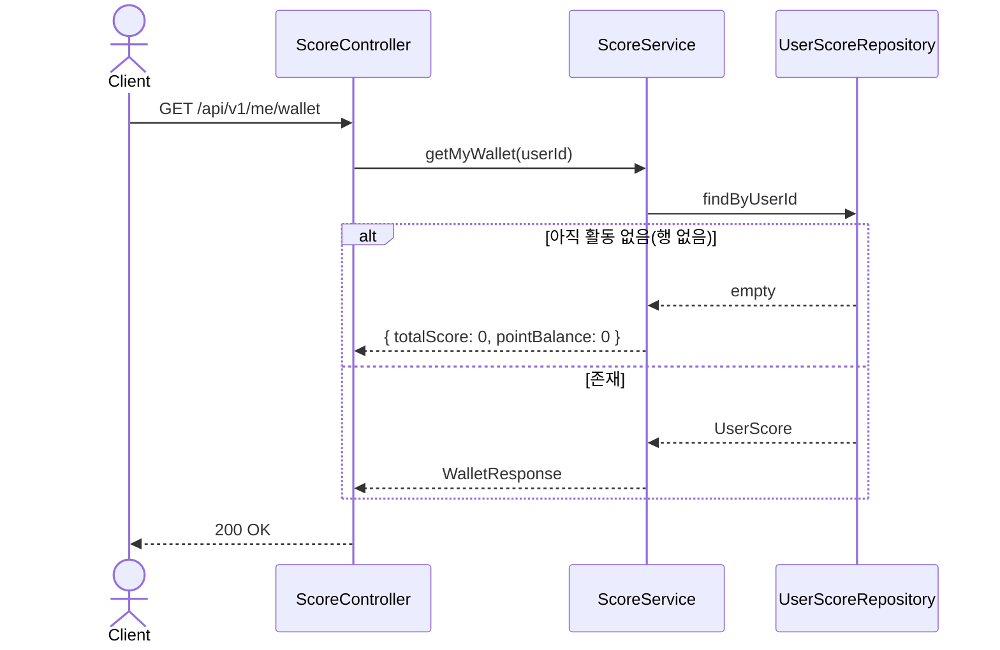
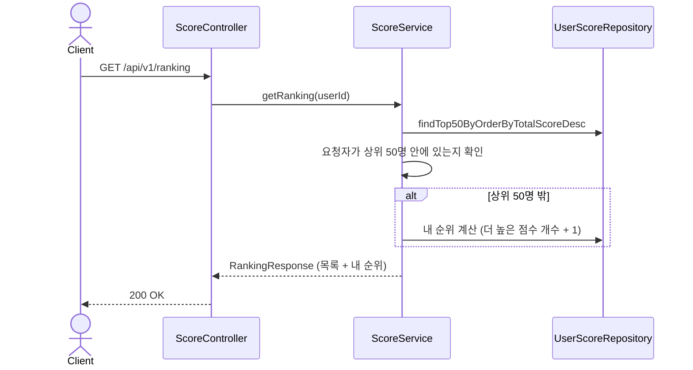

# Score(점수/포인트) 도메인 (설계)

## 배경

수익화의 첫 단계. 후기 작성·사진 첨부·지인 초대 같은 활동에 보상을 줘서 참여를 늘리고, 그 보상을
"랭킹"(경쟁/재미)과 "복권 응모"(2단계, 수익화)에 각각 쓸 수 있게 한다. 하단 탭도 기존 3개(홈/등록/
프로필)에서 랭킹·혜택(포인트 사용처) 2개를 더해 5개가 된다 — 이 문서는 그 중 **점수 적립 + 랭킹만**
다룬다. 복권(포인트 차감)과 광고는 이후 단계에서 별도 문서로 설계한다.

## 점수 vs 포인트 — 왜 분리하는가

- **점수(score)**: 랭킹 전용. 누적만 되고 **줄지 않는다**. "이 사람이 얼마나 활동했는가"의 지표.
- **포인트(point)**: 지갑 잔액. 적립되면 늘고, 나중에 복권 응모 등으로 **쓰면 준다**.
- 같은 활동(후기 작성 등)이 점수와 포인트를 **동시에** 적립시키지만, 포인트를 다 써도 랭킹(점수)은
  내려가지 않는다 — "복권을 많이 사서 랭킹이 떨어지는" 불합리한 상황을 막기 위함.
- 두 값 다 `user_score` 테이블 한 행에 같이 둔다(`total_score`, `point_balance`). 유저:지갑은 1:1.

## 데이터 모델

기존 `V1__init_schema.sql`에 `user_score`/`user_score_history`/`ranking` 테이블이 이미 있었지만
JPA 엔티티가 없어 실제로는 쓰이지 않고 있었다. `point_balance`, `target` 컬럼이 없어서
`V3__add_point_balance.sql`로 추가한다 (V2는 이미 맛집 대표 사진 기능이 선점).

```sql
-- V3__add_point_balance.sql
ALTER TABLE user_score
    ADD COLUMN point_balance INT NOT NULL DEFAULT 0;

ALTER TABLE user_score_history
    ADD COLUMN target VARCHAR(10) NOT NULL DEFAULT 'SCORE';
```

- `user_score`: `user_id`(UNIQUE) 당 1행. `total_score`(랭킹, 누적) / `point_balance`(지갑, 증감).
  유저가 처음 점수·포인트를 적립받는 시점에 lazy하게 생성한다(회원가입 시 미리 만들지 않음).
- `user_score_history`: 적립/차감 원장. `target`(`SCORE`|`POINT`), `delta`(+/-), `reason`(적립/차감
  사유 — `REVIEW_CREATE`, `REVIEW_PHOTO`, `INVITE`, `POINT_SPEND` 등), `review_id`(후기 관련이면).
  감사·문의 대응용이라 절대 삭제하지 않는다.
- `ranking`: 이번 단계에서는 쓰지 않는다(기간별 스냅샷은 나중 단계). 랭킹 API는
  `user_score.total_score DESC`로 실시간 조회하는 라이브 리더보드로 충분하다.

## 적립 정책

`ScorePolicy`(상수 모음)로 정책을 코드 한 곳에 모은다 — 나중에 정책이 바뀌어도 이 파일만 보면 됨.

| 활동 | 점수 | 포인트 | 비고 |
|---|---|---|---|
| 후기 작성 | +10 | +10 | 첫 저장 시에만 (수정은 재적립 안 함) |
| 후기에 사진 1장 이상 첨부 | +5 | +5 | 후기 작성 보너스에 추가로 얹힘 |
| 내 초대코드로 신규 가입 발생 | +20 | +20 | 초대한 사람(inviter)에게 적립. 가입자 본인에게는 없음 |

## API 목록

| Method | Path | 설명 | 인증 |
|---|---|---|---|
| GET | /api/v1/me/wallet | 내 점수/포인트 잔액 조회 | 필요 |
| GET | /api/v1/ranking | 랭킹(점수 내림차순) 조회, 상위 N명 + 내 순위 | 필요 |

## 비즈니스 규칙

- 점수·포인트는 `ScoreService`를 통해서만 움직인다 — 후기/초대/(추후) 광고/복권 전부 이 서비스
  호출로만 적립·차감하고, 원장(`user_score_history`)에 반드시 기록을 남긴다.
- `UserScore` 행이 없는 유저가 처음 적립받으면 그 자리에서 0으로 생성 후 적립한다(회원가입 때
  미리 만들지 않음 — 아직 활동 없는 유저까지 랭킹에 끼워주지 않기 위함).
- 포인트 차감(`spendPoints`, 2단계 복권에서 사용)은 잔액보다 많이 빼려 하면 실패한다
  (`INSUFFICIENT_POINT` 에러) — 이번 단계에는 차감 API가 없으니 방어 로직만 미리 둔다.
- 후기 **수정**은 점수/포인트를 다시 주지 않는다(최초 작성 1회만). 후기 **삭제**도 이미 지급한
  점수/포인트를 회수하지 않는다(단순함 우선 — 어뷰징 방지는 이후 과제).
- 랭킹은 `total_score` 내림차순 상위 N명(예: 50명)을 보여주고, 내가 그 안에 없으면 내 순위를
  별도로 한 번 더 계산해 같이 내려준다(항상 "내 순위"는 알 수 있게).
- 초대 적립은 기존 `UserService.signup()`의 상호 팔로우 로직([auth.md](auth.md),
  [follow.md](follow.md) 참고) 바로 옆에 붙는다 — 초대자 검증(존재 여부)은 이미 그 로직이 하고
  있으므로 재검증하지 않는다.

## 시퀀스 다이어그램

### 1. 후기 작성 시 점수/포인트 적립


### 2. 초대코드로 가입 시 초대자에게 적립


### 3. 내 지갑 조회


### 4. 랭킹 조회


## 프론트 영향

- 하단 탭(`BottomNavigation.tsx`) 3개 → 5개: 홈 / **랭킹** / 등록(중앙) / **혜택** / 프로필.
- `PointsPage.tsx`(현재 "준비 중" 플레이스홀더)를 지갑 화면으로 교체 — 점수/포인트, 적립 내역.
- 신규 `RankingPage.tsx` — 리더보드, 아바타는 기존 `avatarColor.ts` 재사용.
- (2단계 이후 과제, 이번 범위 아님) 복권 응모 화면, 포인트 차감 API, 광고 시청 API.

## 랭킹 확장: 스코프(GLOBAL/NETWORK/LOCAL) + Redis

전체 랭킹 하나만으로는 "낯선 사람과 순위 경쟁"이 돼버려 지인 기반 신뢰 플랫폼 정체성과 맞지 않는다.
기존 전체 랭킹은 유지하되, 두 가지를 더한다.

- **GLOBAL**(기존): 전체 유저 대상 `total_score` 랭킹.
- **NETWORK**(신규): 내 1~3촌(팔로우 네트워크)끼리만 겨루는 랭킹. "모르는 사람들 사이에서 128등"보다
  "내가 아는 사람들 사이에서 3등"이 이 앱의 핵심 가치(지인 기반 신뢰)에 맞다. [follow.md](follow.md)의
  `FollowRepository.findNetworkDegrees`(재귀 CTE, 이미 존재)를 그대로 재사용한다 — 촌수 계산 로직을
  중복 구현하지 않는다.
- **LOCAL**(신규, "동네 맛집 마스터"): 특정 지역(`region` 쿼리 파라미터, 예: "강남구")에서 리뷰를 많이
  남긴 사람 랭킹. 활동량이 아니라 "이 동네는 이 사람 말을 믿어도 된다"는 전문성 포지셔닝이라 신뢰
  기반 브랜딩에 맞는다. `restaurants.address`에 지역 문자열이 포함된 맛집에 남긴 리뷰 수로 집계한다
  (region 컬럼을 새로 만들지 않고 기존 address 텍스트를 `LIKE` 매칭 — 행정구역 테이블 정규화는
  지금 규모에서 과설계라 하지 않는다).

### GLOBAL 랭킹에만 Redis(ZSET)를 적용하는 이유

기존 GLOBAL 랭킹은 요청마다 `ORDER BY total_score DESC LIMIT 50` + `COUNT(*) WHERE total_score > ?`
쿼리를 라이브로 날렸다(Redis 미적용, 지금까지 확인된 사실). 트래픽이 커지면 이 두 쿼리가 랭킹 조회마다
반복 실행되는 게 가장 먼저 병목이 된다 — GLOBAL은 **모든 유저가 같은 결과를 보는** 조회라 캐시 효율이
가장 높다.

- `score/infrastructure/redis/GlobalRankingCache`: Redisson `RScoredSortedSet`(ZSET) 하나로
  전체 랭킹을 상시 유지한다. `ScoreService.earn()`/`spendPoints`가 아니라 **점수(score)가 바뀔 때만**
  `addScore(userId, delta)`(ZINCRBY)로 갱신한다 — 매 요청마다 재계산하지 않고 쓰기 시점에 증분 반영.
- 상위 N명 조회는 `ZREVRANGE`(O(log n + N)), 내 순위는 `ZREVRANK`(O(log n)) — 기존의 `COUNT(*)` 풀스캔
  성격 쿼리를 완전히 대체한다.
- **콜드스타트**: Redis가 비어있으면(운영 중 캐시 flush 등) `NetworkDegreeCache`와 동일한 패턴으로
  sentinel 키(`RANK:GLOBAL:seeded`, TTL 없음)를 두고, 없을 때 DB에서 1회 backfill 후 sentinel을 세운다.
  그 이후로는 `earn()`의 증분 갱신만으로 정합성을 유지한다(주기적 재계산 배치는 없음 — ZINCRBY가
  누적 카운터의 delta와 항상 일치하므로 드리프트가 생기지 않는다).
- **NETWORK/LOCAL은 Redis를 적용하지 않는다**: 둘 다 "전체가 아니라 나 한정으로 스코프된" 조회라
  캐시 히트율이 낮고(유저마다 결과가 다름), 대상 집합 자체가 작다(NETWORK는 최대 수백 명, LOCAL은
  특정 지역 리뷰어로 이미 좁혀짐) — 이 규모에서 별도 캐시 레이어를 두는 건 과설계. 인덱스 기반 라이브
  쿼리로 충분하다.

### API

| Method | Path | 설명 | 인증 |
|---|---|---|---|
| GET | /api/v1/ranking?scope=GLOBAL\|NETWORK (기본 GLOBAL) | 스코프별 점수 랭킹 | 필요 |
| GET | /api/v1/ranking/local?region= | 지역 리뷰 수 랭킹("동네 맛집 마스터") | 필요 |

- `scope=NETWORK`일 때 내 네트워크가 비어있으면(1촌도 없음) 빈 목록 + `myRank=1`을 반환한다(경쟁 상대가
  없으니 자동 1등 — 신규 유저를 위축시키지 않기 위함).
- `/ranking/local`은 `region`이 비어있으면 `INVALID_INPUT` 에러. 해당 지역에 리뷰가 없는 유저는
  `myRank`가 `null`(아직 순위가 없다는 뜻, 0등이 아님)로 내려온다.
