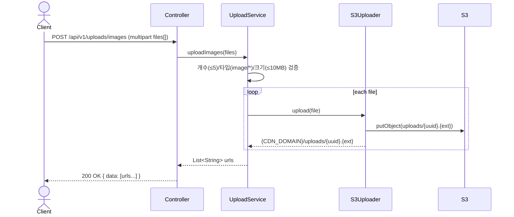

# Upload 도메인

## API 목록

| Method | Path | 설명 | 인증 |
|---|---|---|---|
| POST | /api/v1/uploads/images | 이미지 업로드 (multipart, 최대 5장) → CDN URL 목록 반환 | 필요 |

## 인프라

- S3 버킷(`naknak-uploads-{accountId}`, 비공개)에 업로드하고, 기존 CloudFront 배포의 `/uploads/*` 오리진(OAC)을 통해서만 공개 접근 가능하게 한다. 버킷을 직접 public으로 열지 않는다.
- 최종 URL: `{CDN_DOMAIN}/uploads/{key}` (예: `https://d3vx56q9cwsix.cloudfront.net/uploads/{uuid}.jpg`)
- 무료 티어(월 1TB 아웃바운드, 1000만 요청) 안에서 운영하기 위해 이미 있는 CloudFront 배포를 재사용했다 — 별도 CDN을 새로 만들지 않았다.

## 비즈니스 규칙

- 파일당 최대 10MB, 요청당 최대 5장. (`UploadService.MAX_FILE_COUNT`, `MAX_FILE_SIZE`)
- `content-type`이 `image/*`가 아니면 거부한다 (`INVALID_FILE_TYPE`).
- 빈 파일은 거부한다.
- 저장 키는 원본 파일명을 신뢰하지 않고 `uploads/{UUID}.{ext}` 형태로 생성한다. 확장자는 화이트리스트(jpg/jpeg/png/webp/gif)만 허용, 그 외는 기본값 `jpg`로 강제한다.

## 시퀀스 다이어그램

### 이미지 업로드

